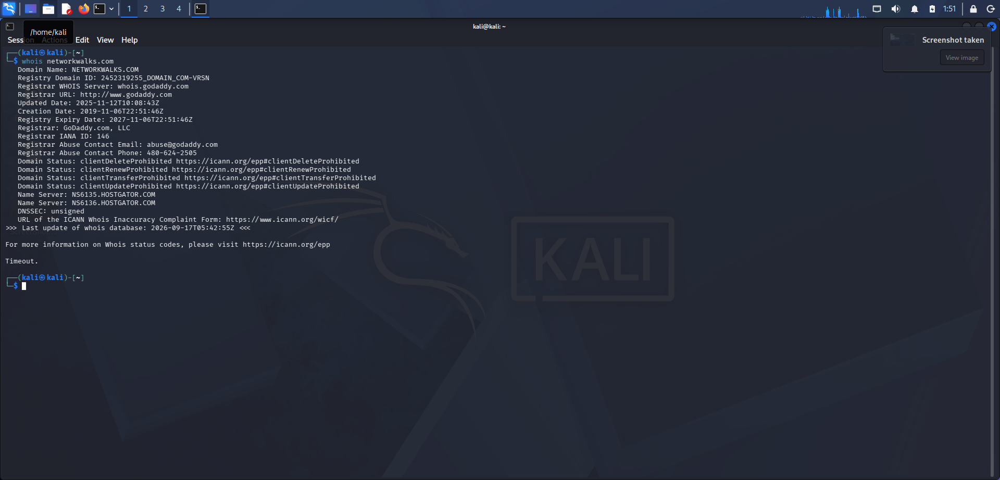
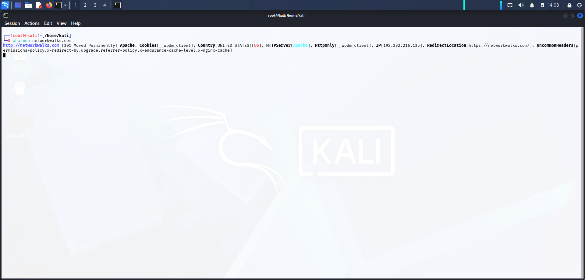
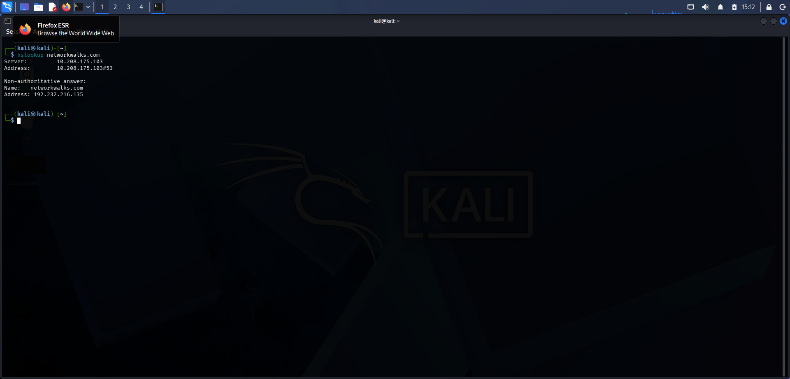
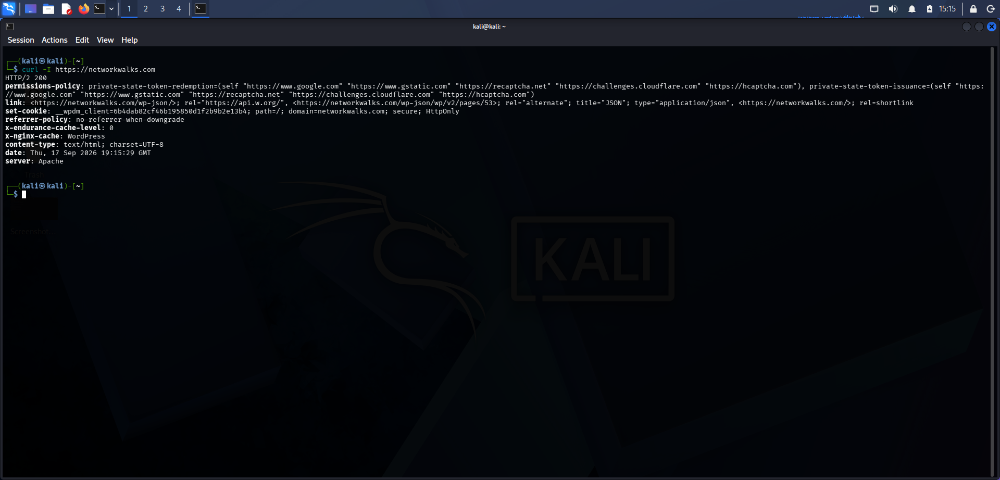
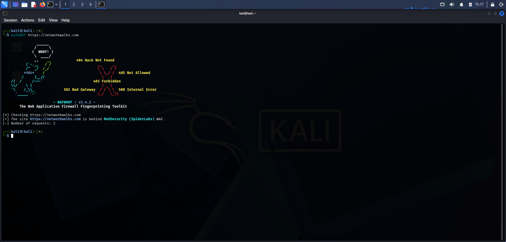
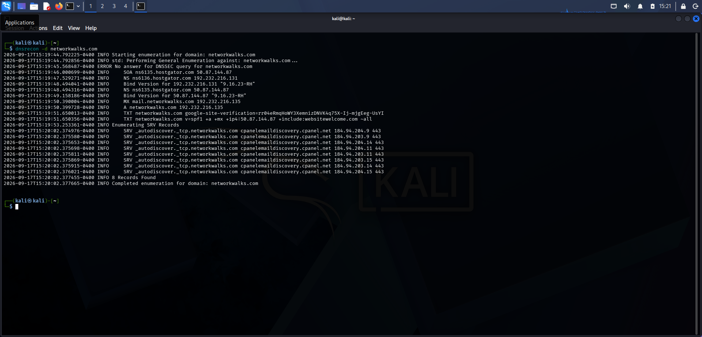

# W2-PM1 — Footprinting with Multiple Kali Tools

## Objective

The objective of this practical is to perform authorized footprinting and reconnaissance using multiple Kali Linux tools.

## Target

`networkwalks.com`

## Tools Used

1. WHOIS
2. WhatWeb
3. NSLookup
4. cURL
5. WAFW00F
6. DNSRecon

---

## Task 1 — WHOIS Enumeration

### Command

```bash
whois networkwalks.com
```

### Findings

The WHOIS query returned publicly available domain registration information, including:

- Registrar: GoDaddy.com, LLC
- Creation Date: 2019-11-06
- Registry Expiry Date: 2027-11-06
- Name Server: NS6135.HOSTGATOR.COM
- Name Server: NS6136.HOSTGATOR.COM

### Screenshot



---

## Task 2 — WhatWeb Fingerprinting

### Command

```bash
whatweb networkwalks.com
```

### Findings

WhatWeb identified publicly observable information about the target website, including:

- HTTP status: 301 Moved Permanently
- Web server: Apache
- IP address: 192.232.216.135
- Redirect location: HTTPS
- WordPress-related indicators
- HTTP cookies and headers

### Screenshot



---

## Task 3 — DNS Resolution with NSLookup

### Command

```bash
nslookup networkwalks.com
```

### Findings

The DNS query resolved the domain to:

```text
networkwalks.com → 192.232.216.135
```

The DNS server used for the query was:

```text
10.208.175.103
```

### Screenshot



---

## Task 4 — HTTP Header Analysis

### Command

```bash
curl -I https://networkwalks.com
```

### Findings

The HTTP response returned:

- HTTP status: 200
- Server: Apache
- Content-Type: text/html
- WordPress-related headers
- HTTP cookie information
- Additional response headers

### Screenshot



---

## Task 5 — WAF Detection

### Command

```bash
wafw00f https://networkwalks.com
```

### Purpose

WAFW00F was used to check whether a Web Application Firewall could be identified from the target's publicly observable web responses.

### Screenshot



---

## Task 6 — DNS Enumeration

### Command

```bash
dnsrecon -d networkwalks.com
```

### Findings

DNSRecon identified multiple DNS records, including:

- NS records
- A record
- MX record
- TXT records
- SRV records

The enumeration reported:

```text
8 Records Found
```

### Screenshot



---

# Key Learnings

This practical demonstrated how different reconnaissance tools provide different types of publicly observable information.

| Tool | Purpose |
|---|---|
| WHOIS | Domain registration information |
| WhatWeb | Web technology fingerprinting |
| NSLookup | DNS resolution |
| cURL | HTTP response/header analysis |
| WAFW00F | WAF detection |
| DNSRecon | DNS record enumeration |

# Conclusion

This practical demonstrated a basic reconnaissance and footprinting workflow using multiple Kali Linux tools. Each tool provided a different perspective of the target's publicly observable infrastructure.

> All activities in this practical were performed for educational and authorized cybersecurity learning purposes.
